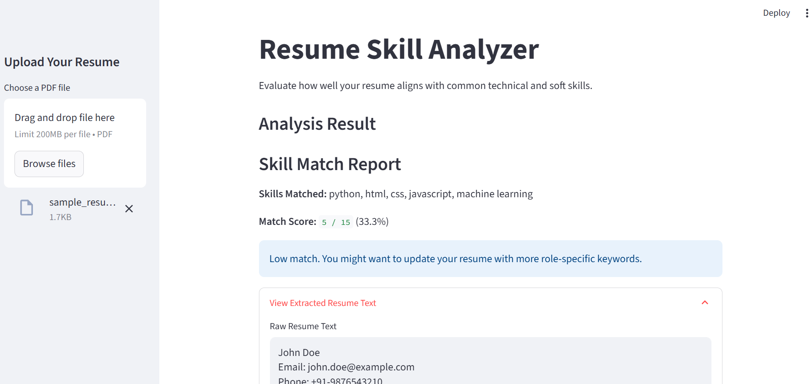

# 🧠 Resume Skill Analyzer

A minimal, clean, and beginner-friendly tool to analyze how well your resume matches with commonly required technical and soft skills using Natural Language Processing (NLP).

> Built using **Python**, **spaCy**, **Streamlit**, and **PyMuPDF**

---

## 🎯 Features

- 📄 Upload your resume in **PDF format**
- 🔍 Automatically extracts and cleans your resume content
- 🧠 Uses NLP to detect **key technical and soft skills**
- 📊 Provides a **skill match score**
- 📝 Displays which skills were detected or missing
- 📋 View your **raw resume text** for review

---

## 💻 Demo Screenshot



> Add this screenshot to a `screenshots/` folder in your repo after taking one

---

## 🛠️ Technologies Used

- Python 3.x
- [Streamlit](https://streamlit.io/)
- [spaCy (en_core_web_sm)](https://spacy.io/)
- [PyMuPDF (fitz)](https://pymupdf.readthedocs.io/)

---

## 🚀 Getting Started

### 🔧 Install dependencies

```bash
pip install streamlit spacy pymupdf
python -m spacy download en_core_web_sm
